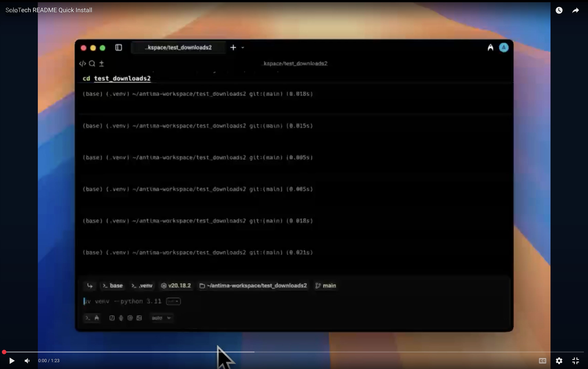

# Solo Server

<div align="center">

[](https://www.python.org/downloads/)
[](https://opensource.org/licenses/MIT)
[](https://pypi.org/project/solo-server/)

**Production-ready server for Physical AI inference with FastMCP integration**

Add specialized AI capabilities to any inference server with modular Python components

</div>

## Installation

```bash
#If installing uv for the first time,
curl -LsSf https://astral.sh/uv/install.sh | sh
# or
brew install uv
# check that version of uv is 0.9.3 or above
# Install uv version 0.9.3
uv self update

# Create virtual environment, recommended Python version 3.12
uv venv --python 3.12.12
#Mac and Linux
source .venv/bin/activate
#for windows use 
source .venv/scripts/activate

#Choose one of the following installation methods
#1. Install solo server from PyPi python manager
uv pip install solo-server

#2. Install solo server from source
git clone https://github.com/GetSoloTech/solo-server.git
cd solo-server
uv pip install -e .

# Solo commands
solo --help

```

<details>
<summary><strong>Video: quickstart installation</strong></summary>

[](https://youtu.be/ci-Hw0rfnN0)

</details>

## Solo Commands:

```bash
solo --help
                                                                                                           
╭─ Commands ──────────────────────────────────────────────────────────────────────────────────────────────────────────────────────────────────────────────────────────────────────────────────────────────────────────╮
│ setup      Set up Solo Server environment with interactive prompts and saves configuration to config.json.                                                                                                          │
│ robo       Robotics operations: motor setup, calibration, teleoperation, data recording, training, and inference                                                                                                    │
│ serve      Start a model server with the specified model.                                                                                                                                                           │
│ status     Check running models, system status, and configuration.                                                                                                                                                  │
│ list       List all downloaded models available in HuggingFace cache and Ollama.                                                                                                                                    │
│ test       Test if the Solo server is running correctly. Performs an inference test to verify server functionality.                                                                                                 │
│ stop       Stops Solo Server services. You can specify a server type with 'ollama', 'vllm', or 'llama.cpp'                                                                                                          │
│            Otherwise, all Solo services will be stopped.                                                                                                                                                            │
│ download   Downloads a Hugging Face model using the huggingface repo id.                                                                                                                                            │
╰─────────────────────────────────────────────────────────────────────────────────────────────────────────────────────────────────────────────────────────────────────────────────────────────────────────────────────╯

```
## Start server with SML models

```bash

# Note that you will need Docker for solo serve
solo setup
solo serve --server ollama --model llama3.2:1b
```

## Interactive Lerobot With Solo Server
Find more details here: [Solo Robo Documentation](solo_server/commands/robots/lerobot/README.md) 

```bash
# Motors (both) → Calibrate (both) → Teleop
solo robo --type lerobot --motors both
solo robo --type lerobot --calibrate both
solo robo --type lerobot --teleop

# Record a new local dataset with prompts
solo robo --type lerobot --record

# Train Diffusion Policy on a recorded dataset and push to Hub
solo robo --type lerobot --train

# Inference with a hub model id (with optional Teleop override)
solo robo --type lerobot --inference
```

## API Reference
Find more details here: OpenAI -> [OpenAI API Docs](https://platform.openai.com/docs/api-reference/introduction) Ollama -> [Ollama API Docs](https://docs.ollama.com/api)

### vLLM & llama.cpp (OpenAI Compatible)

```bash
# Chat request endpoint
curl http://localhost:5070/v1/chat/completions \
  -H "Content-Type: application/json" \
  -d '{
    "model": "llama3.2",
    "messages": [{"role": "user", "content": "Analyze sensor data"}],
    "tools": [{"type": "mcp", "name": "VitalSignsMCP"}]
  }'
```

### Ollama
```bash
# Chat request endpoint
curl http://localhost:5070/api/chat -d '{
  "model": "llama3.2",
  "messages": [
    {
      "role": "user",
      "content": "why is the sky blue?"
    }
  ]
}'
```

## Configuration
Navigate to config file
`.solo_server/config.json` 

```json
{
    "hardware": {
        "use_gpu": false,
        "cpu_model": "Apple M3",
        "cpu_cores": 8,
        "memory_gb": 16.0,
        "gpu_vendor": "None",
        "gpu_model": "None",
        "gpu_memory": 0,
        "compute_backend": "CPU",
        "os": "Darwin"
    },
    "user": {
        "domain": "Software",
        "role": "Full-Stack Developer"
    },
    "server": {
        "type": "ollama",
        "ollama": {
            "default_port": 5070
        }
    },
    "active_model": {
        "server": "ollama",
        "name": "llama3.2:1b",
        "full_model_name": "llama3.2:1b",
        "port": 5070,
        "last_used": "2025-10-09 11:30:06"
    }
}
```

## Contributing

1. Fork the repository
2. Create feature branch (`git checkout -b feature/name`)
3. Commit changes (`git commit -m 'Add feature'`)
4. Push to branch (`git push origin feature/name`)
5. Open Pull Request 